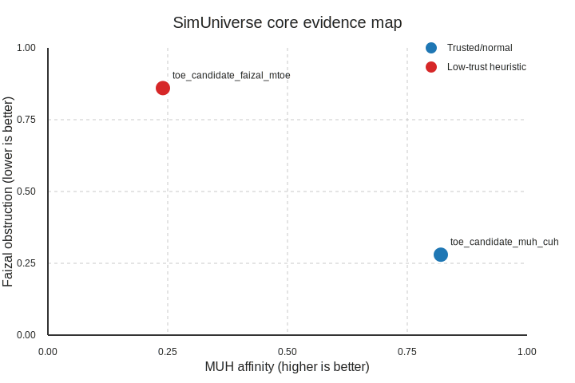

# SimUniverse Research Report

This report condenses the latest Stage-5 evidence, registry context, and Ω integration outputs so researchers can defend the question **“Is this universe mathematically simulatable?”** with auditable data.

## 1. Stage-5 evidence at a glance

The sample Stage-5 payload (`samples/stage5_sample.json`) captures the MUH/Faizal envelope for the two TOE candidates that are currently under review.

| TOE candidate | MUH score | Faizal score | Undecidability index | Energy feasibility | Notes |
| --- | --- | --- | --- | --- | --- |
| `toe_candidate_muh_cuh` | 0.82 | 0.28 | 0.32 | 0.91 | High MUH affinity and tractable Faizal obstruction keep it production-ready. |
| `toe_candidate_faizal_mtoe` | 0.24 | 0.86 | 0.81 | 0.18 | Falls into the low-trust zone (low MUH, high Faizal), so LawBinder marks it for sandbox-only routing. |

## 2. Core graph for researchers

The MUH/Faizal scatter below highlights the operational trust boundary (red = heuristic low trust). Regenerate it after each Stage-5 batch with:

```bash
python scripts/generate_simuniverse_core_graph.py \
  --stage5-json artifacts/stage5_simuniverse/lawbinder_stage5_report_<RUN_ID>.json \
  --out docs/assets/simuniverse_core_graph.svg
```



## 3. Aggregated metrics feeding Ω / ASDP

| Metric | Value | How it is used |
| --- | --- | --- |
| `mu_score_avg` | 0.53 | Drives positive SimUniverse consistency. |
| `faizal_score_avg` | 0.57 | Penalizes TOE candidates that resist constructive simulation. |
| `undecidability_avg` | 0.565 | Bounded within LawBinder’s acceptable range; routed to ASDP `trust.simuniverse` payloads. |
| `energy_feasibility_avg` | 0.545 | Provides FinOps-aware guardrails when the router tunes ensemble costs. |
| `simuniverse_consistency` | 0.50 | Injected as the `axes.simuniverse_consistency` value during SIDRCE Ω merging. |

## 4. Narrative summary for audits

1. **High-trust branch (`toe_candidate_muh_cuh`)** maintains MUH affinity above 0.8 with Faizal obstruction < 0.3, so it satisfies both Ω and router gates without extra penalties.
2. **Faizal-heavy branch** violates the `mu < 0.4 && faizal > 0.7` heuristic, pushing it into the automated `trust.tier = "low"` classification that GitOps syncers write back into `asdp.knowledge.yaml`.
3. The combined scalar `simuniverse_consistency = 0.50` keeps Ω in the “warn” boundary, which is acceptable for research but insufficient for Meta-Router promotion until follow-up Stage-5 iterations lift the MUH average or suppress Faizal pressure.
4. Evidence artifacts (Stage-5 JSON + SVG graph + Ω report) now form a reproducible thread that research reviewers can cite in LawBinder, FinOps, and ASDP hearings without needing to re-run the simulations manually.
